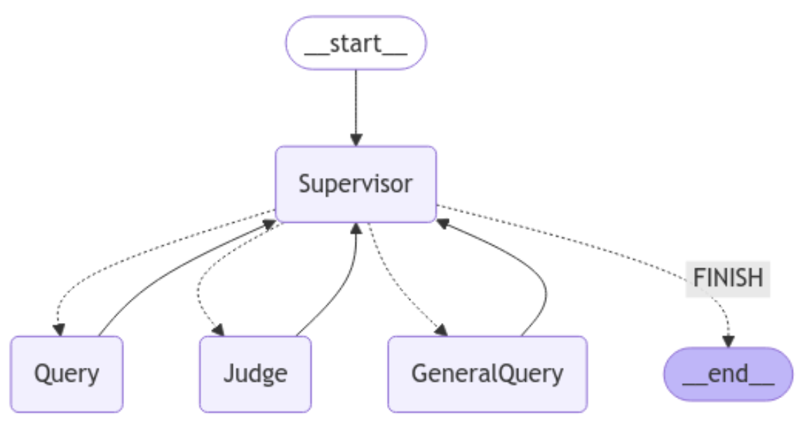

# Multi-Agent 시스템

이 프로젝트는 사용자의 입력에 따라 공부 내용을 처리하는 멀티 에이전트 시스템입니다. 시스템은 **supervisor** 노드를 중심으로 사용자 입력을 처리하며, 입력 내용에 따라 적절한 노드로 분기합니다.

### 시스템 작동 방식

이 시스템은 사용자의 입력을 처리하고 적합한 노드로 분배하는 방식으로 작동합니다. 각 단계는 다음과 같습니다:

1. **사용자 입력 시작**  
   사용자가 텍스트를 입력하면 시스템이 이를 처리하기 시작합니다.

2. **Supervisor 노드에서 분석**  
   입력된 텍스트는 `Supervisor` 노드에서 분석되며, 입력의 성격에 따라 적합한 노드로 라우팅 됩니다:
   - 학습과 관련된 내용 → `Query Node`  
   - 질문에 대한 답변 → `Judge Node`  
   - 일반적인 텍스트 → `GeneralQuery Node`

3. **처리 결과 제공 및 종료**  
   - `Query Node` → 사용자의 학습 내용에 대한 질문 생성
   - `Judge Node` → 질문에 대한 사용자의 답변 개선점, 평가 생성
   - `GeneralQuery Node` → LLM 결과 그대로 사용자에게 전달
   적합한 노드에서 작업이 완료되면 결과가 사용자에게 전달되고, 시스템이 종료됩니다.



## 사용 방법

### 1. 환경 설정

- 이 시스템은 `langgraph` 라이브러리를 사용하여 구현되었습니다.
- `gpt-4o-mini` 모델을 사용하므로, `.env` 파일에 본인의 OPENAI API 키를 입력해야 합니다.

```env
OPENAI_API_KEY="YOUR_API_KEY"
```

### 2. 실행 방법

이 프로젝트는 `streamlit`을 통해 웹 인터페이스로 실행됩니다. 아래 명령어로 실행할 수 있습니다:

```bash
streamlit run main.py
```

### 3. 필수 라이브러리

이 프로젝트는 아래의 라이브러리를 필요로 합니다:

- `langgraph`
- `streamlit`

`requirements.txt` 파일에서 확인할 수 있습니다.


### 라이센스
이 프로젝트는 MIT 라이센스 하에 제공됩니다.
